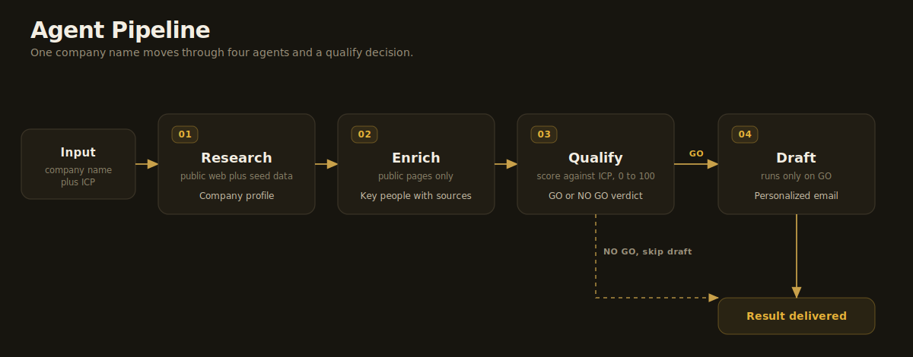
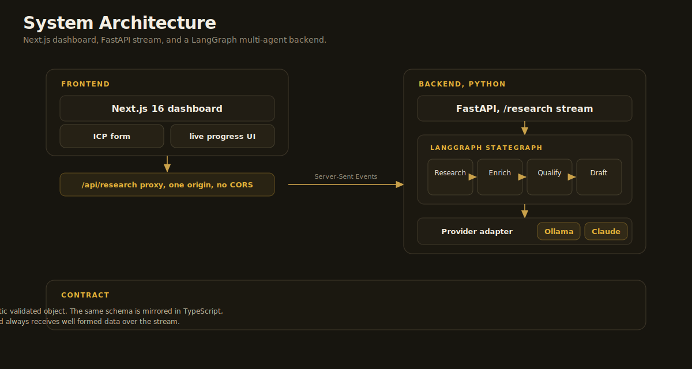

# AI Sales Lead Researcher

A multi-agent system that turns a single company name into a qualified lead and a ready to send cold email. It runs the research an SDR would otherwise do by hand, then decides whether the lead is worth pursuing before it writes anything.

   

## What it does

Give it a company name and your Ideal Customer Profile. A LangGraph pipeline runs four agents and streams their progress to the dashboard as each one finishes.

| Agent | Output |
| --- | --- |
| Research | Company profile with industry, size, location, products, and recent signals from public web sources |
| Enrich | Decision makers taken from public pages only, each kept with its source URL |
| Qualify | A fit score from 0 to 100 against your ICP, with matched criteria, gaps, and a GO or NO GO verdict |
| Draft | A personalized cold email, written only when the lead qualifies |

The verdict after the qualify step is the point of the project. A lead that does not qualify stops there and never reaches the drafting agent. That is real triage, not a linear script.

## Pipeline



## Architecture



The browser talks to the Next.js dashboard. A route handler proxies the request to FastAPI, which runs the LangGraph state graph and relays each agent event as Server-Sent Events. The dashboard reads one origin, so there is no CORS to manage. Every agent returns a Pydantic validated object, and the same schema is mirrored in TypeScript, so the UI always receives well formed data. See [docs/architecture.md](docs/architecture.md) for the full data flow.

## Why it is built this way

- The orchestration is Python and LangGraph, the recognizable way to build a multi-agent system. The dashboard is Next.js and TypeScript, sharing the design language of my [local-ai-chatbot](https://github.com/Achyar-CN) project.
- One provider adapter, two backends. It runs fully offline on Ollama, or on a Claude model for the best output. Switching is a single environment variable with no code change.
- No LinkedIn scraping. That violates LinkedIn terms of service, is brittle, and gets accounts banned. People come from public pages and a curated seed dataset instead, and each one carries a source URL. The constraint is deliberate and shows judgement rather than a shortcut.

## Requirements

- Python 3.11 or newer and Node.js 20 or newer.
- For the default offline mode, [Ollama](https://ollama.com) running locally with a model pulled:

```bash
ollama pull llama3.2:3b
```

## Quick start

Backend:

```bash
cd backend
python -m venv .venv
.venv/Scripts/activate
pip install -e ".[dev]"
cp .env.example .env
uvicorn app.main:app --reload
```

Frontend:

```bash
cd frontend
npm install
npm run dev
```

Open http://localhost:3000, click Fill demo, pick Acme Corp, and run the agents. On macOS or Linux use `source .venv/bin/activate` in the backend step.

## Configuration

The backend reads `backend/.env`.

```ini
# Offline, free, private (default)
LLM_PROVIDER=ollama
OLLAMA_MODEL=llama3.2:3b

# Frontier quality, needs an API key
LLM_PROVIDER=claude
ANTHROPIC_API_KEY=sk-ant-...
CLAUDE_MODEL=claude-opus-4-8
```

The agents call one interface in `app/llm/provider.py`. Nothing else changes between providers.

## Testing

```bash
cd backend
pytest
```

The suite covers schema validation, provider output parsing, each agent node, and the GO versus NO GO routing. It runs without a network or a live model. Deterministic logic is unit tested, and LLM steps are tested by contract, meaning the output validates against the schema rather than matching exact text, using the seed fixtures.

## Tech stack

Backend: Python 3.11, LangGraph, FastAPI, Pydantic v2, httpx, trafilatura, Anthropic SDK, Ollama.

Frontend: Next.js 16, React 19, TypeScript, Tailwind CSS 4, lucide-react.

## Project structure

```
backend/    FastAPI and LangGraph multi-agent pipeline (see backend/app/graph)
frontend/   Next.js 16 streaming dashboard
docs/        Architecture notes and diagrams
```

## Notes

- Live extraction is best effort. For an unknown company the quality depends on what is publicly indexed. The seed set, Acme Corp and Globex Industries, keeps the demo clean and works offline.
- No email is ever sent. The system drafts, and a person reviews and sends.
- An email address is left empty unless it literally appears on a public page. The system never fabricates contact details.
